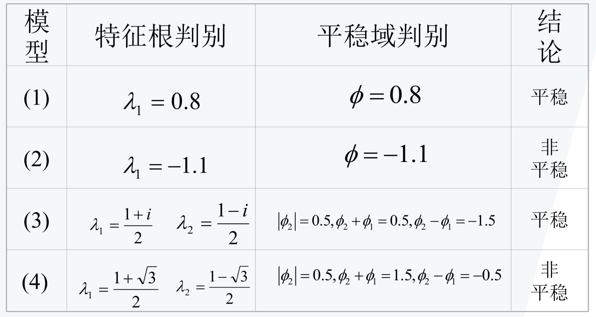
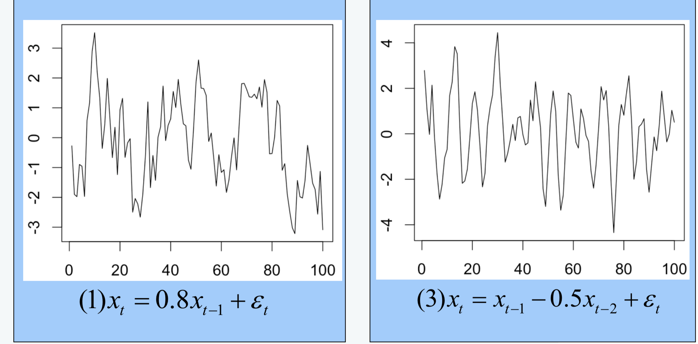
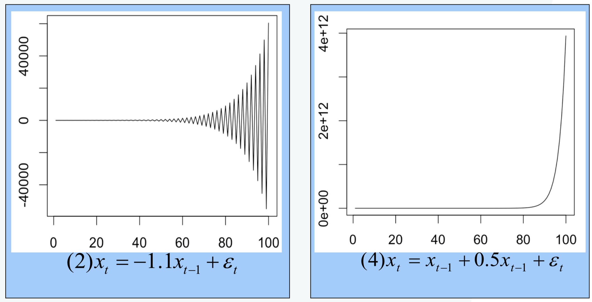

**AR模型定义**

具有如下结构的模型称为*p* 阶自回归模型，记为*AR*(*p*)

$\left\{\begin{array}{l}{x_{t}=\phi_{0}+\phi_{1} x_{t-1}+\phi_{2} x_{t-2}+\Lambda+\phi_{p} x_{t-p}+\varepsilon_{t}} \\ {\phi_{p} \neq 0} \\ {E\left(\varepsilon_{t}\right)=0, \quad \operatorname{Var}\left(\varepsilon_{t}\right)=\sigma_{\varepsilon}^{2}, E\left(\varepsilon_{t} \varepsilon_{s}\right)=0, s \neq t} \\ {E x_{s} \varepsilon_{t}=0, \forall s<t}\end{array}\right.$

**当$\phi_0 = 0$ 时，成为中心化AR(p)模型**

称${y_t}$ 为 ${x_t}$ 的中心化序列，令

$\mu=\frac{\phi_{0}}{1-\phi_{1}-\Lambda-\phi_{p}}$
$y_{t}=x_{t}-\mu$

**AR模型平稳性判别**

* 判别原因
  * AR模型是常用的平稳序列的拟合模型之一，但并非所有的AR模型都是平稳的
* 判别方法
  * 单位根判别法：p个特征根都在单位圆内
  * 平稳域判别法：$\left\{\phi_{1}, \phi_{2}, \mathrm{L}, \phi_{p}\right.| $} 特征根都在单位圆内

**AR(1)模型平稳条件**

* 方程结构：$x_{t}=\phi x_{t}+\varepsilon_{t}$
* 特征根 ：$\lambda=\phi$
* 平稳域：$|\phi|<1$

**AR(2)模型平稳条件**

* 方程结构：$x_{t}=\phi_{1} x_{t-1}+\phi_{2} x_{t-2}+\varepsilon_{t}$

* 特征根：$\lambda_{1}=\frac{\phi_{1}+\sqrt{\phi_{1}^{2}+4 \phi_{2}}}{2} \quad \lambda_{2}=\frac{\phi_{1}-\sqrt{\phi_{1}^{2}+4 \phi_{2}}}{2}$

* 平稳域：

   (1) $\left|\phi_{2}\right|=\left|\lambda_{1} \lambda_{2}\right|<1$
  $(2) \phi_{2}+\phi_{1}=-\lambda_{1} \lambda_{2}+\lambda_{1}+\lambda_{2}=1-\left(1-\lambda_{1}\right)\left(1-\lambda_{2}\right)<1$
  $(3) \phi_{2}-\phi_{1}=-\lambda_{1} \lambda_{2}-\lambda_{1}-\lambda_{2}=1-\left(1+\lambda_{1}\right)\left(1+\lambda_{2}\right)<1$
  $\Rightarrow\left\{\phi_{1}, \phi_{2}|| \phi_{2} |<1, \quad \exists \phi_{2} \pm \phi_{1}<1\right\}$

**举例说明**

(1) $x_{t}=0.8 x_{t-1}+\varepsilon_{t}$
(2) $x_{t}=-1.1 x_{t-1}+\varepsilon_{t}$
(3) $x_{t}=x_{t-1}-0.5 x_{t-2}+\varepsilon_{t}$
(4) $x_{t}=x_{t-1}+0.5 x_{t-2}+\varepsilon_{t}$

**各个方程对应时序图**

### AR模型的统计性质

